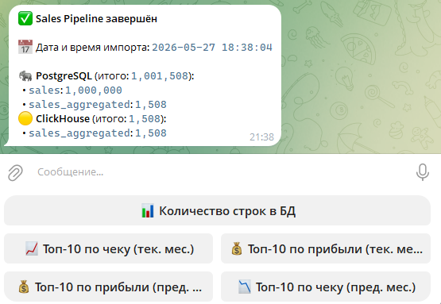
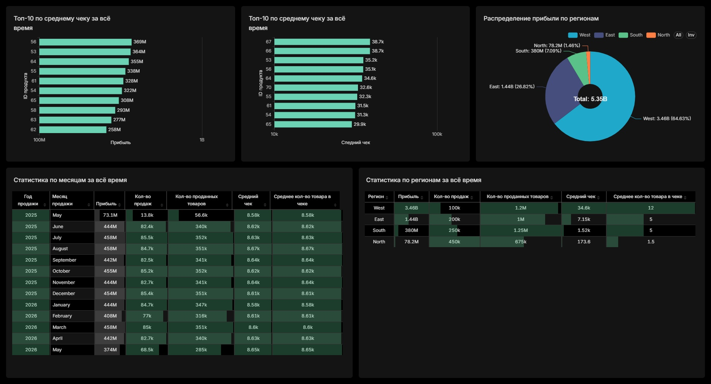

# 𓍝 Sales Analytics Pipeline


> Автоматизированный ETL-пайплайн: генерация → обработка → хранение → аналитика → мониторинг

> Оркестрация через **Airflow**, обработка на **Spark**, хранение в **PostgreSQL** и **ClickHouse**, визуализация в **Superset**, мониторинг через **Telegram**.

---
## 🛠️ Стек технологий

| Сервис             | Назначение                                  |
|--------------------|---------------------------------------------|
| Apache Airflow     | Оркестрация DAG'ов (CeleryExecutor)         |
| Apache Spark       | Обработка и агрегация данных (PySpark)      |
| PostgreSQL         | Хранение сырых данных и агрегатов           |
| ClickHouse         | Аналитическое хранилище                     |
| Telegram Bot       | Уведомления о DAG и интерактивные графики   |
| Apache Superset    | BI‑дашборд                                  |
| Redis 7.2          | Брокер задач Celery                         |
---

## 📦 Сервисы и контейнеры

### 🗄️ Инфраструктура данных

| Контейнер | Образ | Порты      | Назначение |
|-----------|-------|------------|------------|
| `postgres`  | postgres:13 |  —  | Хранит метаданные Airflow (DAG runs, task states, логи). Используется только внутри стека Airflow, снаружи недоступен
| `postgres_user` | postgres:15 | `5432`  | Хранит бизнес-данные проекта: таблицы `sales` и `sales_aggregated`
| `clickhouse_user` | yandex/clickhouse-server | `8123`, `9000`  | Хранит агрегированную таблицу `sales_aggregated` для быстрой аналитики
| `redis` | redis:7.2 | — | Брокер сообщений для Celery. Передаёт задачи от Airflow Scheduler к Workers. Снаружи не открыт

### 🧮 Вычисления
| Контейнер | Образ | Порты | Назначение |
|-----------|-------|-------|------------|
| `spark_master` | apache/spark:3.5.0 | `8123`, `9000` | Мастер-нода Spark Standalone кластера
| `spark_worker` | apache/spark:3.5.0 | — | Воркер-нода кластера, 2 CPU / 2 GB памяти. Выполняет PySpark-задачи

### 🎺 Оркестрация (Airflow)
Все компоненты Airflow собираются из одного `Dockerfile.airflow` и используют общую конфигурацию `x-airflow-common`.

| Контейнер | Порты | Назначение |
|-----------|-------|------------|
| `airflow-init` | — | Разовая инициализация: миграция БД, создание admin-пользователя, директорий. Завершается и останавливается.
| `airflow-webserver` | `8080` | Web UI Airflow. Управление DAG'ами, просмотр логов
| `airflow-scheduler` | — | Планировщик: отслеживает расписание DAG'ов и отправляет задачи в очередь Celery
| `airflow-worker` | — | Celery Worker: забирает задачи из Redis и выполняет их (генерация данных, Spark, загрузка в БД)
| `airflow-triggerer` | — | Обрабатывает отложенные/асинхронные триггеры задач (Deferrable Operators)
| `airflow-cli` | — | CLI-доступ к Airflow для отладки. Запускается только с профилем `debug`
| `flower` | `5555` | Web UI мониторинга Celery. Профиль запуска: `flower`

### 📊 Визуализация и управление
| Контейнер | Порт | Назначение |
|-----------|-------|------------|
| `superset` | `8088` | BI-дашборды поверх ClickHouse и PostgreSQL. Сборка из Dockerfile.superset
| `superset-db` | — | Хранит метаданные Superset (дашборды, датасеты, пользователи)
| `superset-redis` | — | Кэш и очередь асинхронных запросов Superset
| `telegram_bot` | — | Telegram-бот для мониторинга: показывает количество строк в БД, топ-10 продуктов по чеку и прибыли из ClickHouse и PostgreSQL, присылает уведомление о выполнении DAG
---

## 🏛️ Архитектура

```
./data  (общий volume)
   │
   ├── Spark standalone cluster  ──────────────────────────────────┐
   │   (spark-master · spark-worker)                               │
   │                                                               ▼
DAGs ─► Airflow (CeleryExecutor)  ──►  PostgreSQL (user)  ──►  ClickHouse
         webserver · scheduler         postgres_user              │
         worker · triggerer                                        │
              │                                                    ▼
            Redis  (broker)                                    Superset
            (result backend → Postgres)                           │
              │                                                    │
            Flower  (Celery UI)                           Telegram Bot
                                                   (запросы в ClickHouse + Airflow API)
```
---
## 📋 Требования

- Docker >= 24
- Docker Compose >= 2.20
- Свободная RAM: не менее 8 ГБ (16 ГБ рекомендуется для всего стека)
---


## 📂 Структура проекта


```
.
├── config/                      # папка генерируется автоматически, конфиги Airflow
├── dags/
│   └── sales_pipeline_dag.py    # DAG: генерация → Spark → PostgreSQL → ClickHouse → Telegram
├── data/                        # папка генерируется автоматически, внутри появятся CSV‑файлы pipeline
├── logs/                        # папка генерируется автоматически, Airflow logs
├── plugins/                     # папка генерируется автоматически, Кастомные плагины Airflow
├── superset_export/             # экспортированные дашборды Superset (read-only)
│   ├── dashboard.jpg            # скриншот дашборда
│   └── dashboard.zip            # архивированный дашборд для импорта в Superset
├── tg_bot/                      # Telegram-бот
│   ├── bot.py
│   ├── Dockerfile
│   ├── requirements.txt
│   └── tg_bot_screen.png        # скриншот Telegram-бота
├── .env                         # секреты (в git не добавлять!)
├── .env.example                 # шаблон переменных окружения
├── .gitignore
├── docker-compose.yml
├── Dockerfile.airflow           # кастомный образ Airflow
├── Dockerfile.superset          # кастомный образ Superset
├── requirements.txt
└── superset_config.py           # конфигурация Superset
```
---

## 🚀 Первый запуск

1. Создайте `.env` по шаблону `.env.example` и заполните переменные:

   ```bash
   cp .env.example .env
   ```

2. Соберите образы и запустите сервисы:

   ```bash
   docker compose up -d --build
   ```
3. Дождитесь завершения `airflow-init` — он мигрирует БД и создаёт пользователя.

4. Откройте Airflow UI на [http://localhost:8080](http://localhost:8080) и включите/запустите DAG `sales_pipeline`.

5. Импортируйте дашборд в Superset:

   ```bash
   docker exec superset superset import-dashboards -p /app/superset_export/dashboard.zip -u admin
   ```
6. Откройте Superset на [http://localhost:8088](http://localhost:8088) и будет доступен дашборд.

> ⚠️ После первого запуска папки `config/`, `data/`, `logs/`, `plugins/` создаются автоматически.

---

## 🎬 Pipeline

**Расписание:** каждый вторник в 12:45 МСК (09:45 UTC)

```text
[Airflow DAG: sales_pipeline]
        │
        ▼
 generate_sales
    └─ генерация 1 000 000 строк → /data/full_sales_raw.csv

        ▼
 spark_process
    └─ очистка, агрегация, оконные функции → /data/sales_aggregated.csv

        ▼
 load_postgres
    └─ CREATE + TRUNCATE + INSERT → таблицы sales, sales_aggregated в PostgreSQL

        ▼
 load_clickhouse
    └─ TRUNCATE + INSERT → таблица sales_aggregated в ClickHouse (с import_date)

        ▼
 notify_telegram
    └─ уведомление об успешном завершении + количество строк в БД
```

При ошибке на любом шаге отправляется Telegram‑уведомление с именем упавшей таски и текстом исключения.

---

## 🌐 Доступ к сервисам

| Сервис | URL | Логин / Пароль |
|--------|-----|----------------|
| Airflow UI        | http://localhost:8080        | `AIRFLOW_WWW_USER` / `AIRFLOW_WWW_PASSWORD` из `.env` |
| Superset          | http://localhost:8088        | `SUPERSET_ADMIN_USER` / `SUPERSET_ADMIN_PASSWORD` из `.env` |
| Spark Master UI   | http://localhost:8090        | —                                               |
| ClickHouse HTTP   | http://localhost:8123        | — (подключение через HTTP‑клиенты / Superset)   |
| Flower (Celery)   | http://localhost:5555        | доступен при запуске с профилем `flower`        |
| PostgreSQL (user) | `localhost:5432`             | `PG_USER` / `PG_PASSWORD` / `PG_DB` из `.env`   |

---

## 🔍 Ожидаемые результаты

После успешного выполнения DAG:

- В **PostgreSQL**:
  - таблица `sales` содержит ~1 000 000 строк;
  - таблица `sales_aggregated` содержит агрегаты по продуктам / регионам / месяцам.
- В **ClickHouse**:
  - таблица `sales_aggregated` заполнена и готова к аналитическим запросам.
- В **Telegram**:
  - приходит уведомление об успешном/неуспешном завершении;
  - по кнопке «📊 Количество строк в БД» видно количество строк по основным таблицам;
  - доступны графики топ‑10 продуктов по среднему чеку и сумме продаж (текущий и предыдущий месяц).
- В **Superset**:
  - доступен импортированный дашборд с визуализациями продаж по регионам, продуктам и периодам.

---

<p align="center">
  
</p>

<p align="center">
  
</p>
